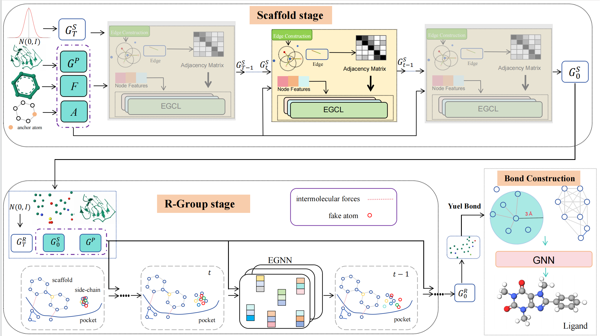

# FDC-Diff：Fragment-based Dual Conditional Diffusion Framework for Molecular Generation
<p align="center">

</p>

## 🧩 Dependencies

This project requires a conda environment for dependency management. Please use the provided environment file to install all required packages.

### 🔧 Setup via Conda

```bash
# Clone the repository (if not done already)
git clone https://github.com/CHT713/FDC-Diff.git
cd FDC-Diff

# Create the environment from the YAML file
conda env create -f FC.yaml(If you encounter download failures, we recommend that you manually download each package that failed individually.)

# Activate the environment
conda activate FC
 ```

## 📦 Dataset Preparation
We use the CrossDocked dataset and the reaction-based slicing method from LibINVENT to construct datasets.To prepare the datasets from scratch, follow the steps below:

1.Download the dataset archive crossdocked_pocket10.tar.gz and the split file split_by_name.pt.(https://drive.google.com/drive/folders/1CzwxmTpjbrt83z_wBzcQncq84OVDPurM)

 You can also find the original CrossDocked dataset at:https://bits.csb.pitt.edu/files/crossdock2020/
 
2.Extract the TAR archive using the command:
```bash
tar -xzvf crossdocked_pocket10.tar.gz
```

3.Split raw PL‑complexes and convert SDF to SMILES:
```bash
python split_and_convert.py
```

4.Use the reaction-based slicing method in [LibINVENT](https://github.com/MolecularAI/Lib-INVENT-dataset)  to slice the molecules into scaffolds and R-groups in Lib-INVENT-dataset and replace and replace example_configurations/supporting_files/filter_conditions.json in Lib-INVENT-dataset with filter_conditions.json in this directory of data.

5.Process datasets：Switch to the data/single directory，Save the results obtained from libinvent, then modify the train_sliced_file, test_sliced_file (the save path for libinvent results), processed_train_file, and processed_test_file (the save path for the final processed data structure) in the data/single/process_and_prepare file.
```bash
python -W ignore process_and_prepare.py
```

## 📦 Training
Change data_path: /data/data in configs/single_full.yml to your data processing path.
```bash
python train.py --config configs/single_full.yml
```

## 📦 Sampling
Switch to the models folder under the yuel_bond directory, and run the following commands to download the bond prediction model weights:
```bash
wget https://zenodo.org/records/15353365/files/geom_3d.ckpt -O models/geom_3d.ckpt
wget https://zenodo.org/records/15353365/files/geom_cdg.ckpt -O models/geom_cdg.ckpt
```
And then, You need to modify the path in the def yuel_bond function in tools/bond_restruction.py, replacing it with your file path. It is recommended to use absolute paths to avoid unnecessary errors.

Futhermore, modify the places involving paths in sample.py and update them to your path address.
```bash
python sample.py
```


## Other datasets
If you want to train and test other datasets on our model：
1. Convert all ligands to SMILES format and write them into a file with the .smi file extension.  For example:
```
CN(CCC(N)CC(=O)NC1CCC(N2C=CC(N)(O)NC2=O)OC1C(=O)O)C(=N)N
COc1cc(OC)c(S(=O)(=O)NCc2ccccc2N2CCCCC2)cc1NC(C)=O
Nc1ncnc2c1ncn2C1OC(COP(=O)(O)OP(N)(=O)O)C(O)C1O
Nc1cc(S(O)(O)O)c(N)c2c1C(=O)c1ccccc1C2=O
```
2. Use LibINVENT to split ligand data into scaffolds and R-groups. (remeber to modify the reaction_based_slicing.json file in the LIBINVENT code. Modify its input and output paths).
3. Save the results obtained from libinvent, then modify the train_sliced_file, test_sliced_file (the save path for libinvent results), processed_train_file, and processed_test_file (the save path for the final processed data structure) in the data/single/process_and_prepare file.To adapt to your input structure, you need to modify the output of process_and_prepare.py to include the following structure:
   1）The structure of the CSV file is as follows:

| uuid | molecule_name | molecule | scaffold | rgroups | anchor | pocket_full_size | pocket_bb_size | molecule_size | scaffold_size | rgroup_size | protein_filename | fragment |
|------|---------------|----------|----------|---------|--------|------------------|-----------------|---------------|---------------|-------------|------------------|----------|
| 0    | __4aaw_A_rec_4ac3_r83_lig_min.pdb | COc1cc(OC)c(S(=O)(=O)NCc2ccccc2N2CCCCC2)cc1NC(C)=O | COc1cc(OC)c(S(=O)(=O)NCc2ccccc2)cc1NC(C)=O | C1CCNCC1 | 0 | 215 | 112 | 31 | 25 | 6 | /home/cht/DiffDec-master/data/crossdocked_pocket10/GLMU_STRPN_2_459_0/4aaw_A_rec_4ac3_r83_lig_tt_min_0_pocket10.pdb | c1ccccc1 |

   2）scaf.sdf
   3) fragment.sdf
   4) pockets.pkl
   5) rgroup.sdf
   6) mol.sdf
(You can refer to our code for specific handling.)
Then modify the preprocess function of datasets.py to replace the paths with the paths of the data you generated above.

5. if you still encounter issues, you may need to modify the dataset.py file in the DDPM directory to ensure compatibility with the input of your dataset.
